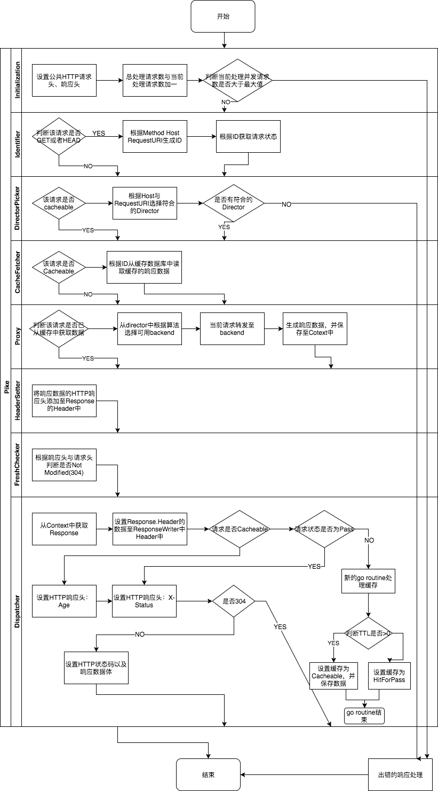

# pike [](https://travis-ci.org/vicanso/pike)


HTTP缓存服务，提供高效简单的HTTP缓存服务。

一直以来都使用`varnish`来做HTTP缓存，喜欢它的性能高效与vcl配置的强大。在规范化缓存的配置之后，强大的vcl对于我也没有太多的作用了，此时我更希望易上手，更简洁的配置，`Pike`则由此诞生。

## 测试命令

go test -race -coverprofile=test.out ./... && go tool cover --html=test.out

go test -v -bench=".*" ./benchmark

## 构建命令

生成后台管理文件

```bash
cd admin \
  && yarn \
  && yarn build \
  && rm ./dist/js/*.map \
  && cd .. \
  && packr -z
```

## 中间件

中间件自定义Cotenxt新增参数有：

- `status`: 该请求对应的状态（必须）
- `identity`: 该请求对应的id（如果是Pass的请求则无此参数）
- `director`: 该请求对应的director
- `resp`: 该请求的响应数据（包括HTTP状态码，响应头，响应内容）
- `createdAt`: 记录context的创建时间
- `serverTiming`: 用于记录生成各中间件处理时长的server timing
- `fresh`: 根据HTTP请求头与响应头判断数据是否为fresh

### Initialization

- 设置公共响应头
- 处理请求数+1，当前处理并发数+1
- 如果当前处理并发数大于最大值（默认为256 * 1000），则返回出错
- 将请求交至下一中间件（在所有中间件处理完成时，当前处理并发数-1）

### Identifier

- 判断该请求是否为Pass(非GET与HEAD请求)，如果是则跳至下一中间件
- 生成请求的唯一ID (method + host + requestURI)
- 获取该ID对应的请求状态（fetching, hitforpas cacheable）
- 设置ID与Status至Context中


## DirectorPicker

- 如果请求是`Cacheable`，直接从缓存中读取，跳过director picker
- 根据Host与Request从配置的director列表中选择符合的director
- 设置符合的director至Context中

## CacheFetcher

- 如果该请求对应的状态不是`cacheable`，则跳至下一中间件
- 从缓存数据库中读取该请求对应的响应数据
- 设置响应数据至Context中

## Proxy

- 如果该请求已经从缓存中获取数据，则跳至下一中间件
- 根据director配置的backend选择算法，选择符合的可用backend
- 将当前请求转发至backend，获取响应数据，并设置至Context中

## HeaderSetter

- 从响应数据中获取响应数据，设置至Responser.Header中

## FreshChecker

- 判断请求是否GET或者HEAD，如果否，则跳至下一中间件
- 判断响应状态码是否 < 200 或者 >= 400，如果是，则跳至下一中间件
- 根据请求头与响应头，判断客户端缓存的数据是否为`fresh`
- 设置`fresh`状态至Context中

## Dispatcher

- 从Context中获取Response
- 如果该请求状态为cacheable，设置HTTP Response Header:Age
- 设置HTTP Response Header:X-Status 
- 判断该请求是否非(cacheable与pass)，根据TTL生成hitForPass或者Cacheable状态写入缓存数据库（新的goroutine）
- 判断`fresh`状态，如果是则直接返回NotModified
- 设置HTTP状态码，根据AcceptEncoding生成响应数据并返回


## 性能测试

### Ping测试

Pike的health check，无其它处理逻辑，返回200

```bash
wrk -H 'Accept-Encoding: gzip, deflate' -t10 -c2000 \
-d1m 'http://127.0.0.1:3015/ping' --latency

Running 1m test @ http://127.0.0.1:3015/ping
  10 threads and 2000 connections
  Thread Stats   Avg      Stdev     Max   +/- Stdev
    Latency    31.75ms   28.44ms   1.31s    97.45%
    Req/Sec     6.55k   527.81    15.52k    74.38%
  Latency Distribution
     50%   28.25ms
     75%   33.96ms
     90%   41.65ms
     99%   80.62ms
  3909084 requests in 1.00m, 447.36MB read
  Socket errors: connect 0, read 0, write 0, timeout 35
Requests/sec:  65049.24
Transfer/sec:      7.44MB
```

### 获取可缓存请求

对于可缓存请求的压测，主要三种情况，客户端不支持压缩、支持gzip压缩、支持br压缩（在我自己的HP gen8 做的压力测试）

#### 客户端不支持压缩

由于默认缓存的数据只有gzip与br两份数据（现在的客户端都支持两种压缩之一），因此如果客户端不支持，需要将gzip解压返回，性能有所损耗，平均每个请求的数据量为：75KB。

```bash
wrk -t10 -c200 -d1m 'http://127.0.0.1:3015/css/app.f81943d4.css' --latency
```

```bash
10 threads and 200 connections
Thread Stats   Avg      Stdev     Max   +/- Stdev
  Latency    66.49ms   69.82ms   1.03s    97.56%
  Req/Sec   337.83     46.65   666.00     74.90%
Latency Distribution
    50%   62.98ms
    75%   76.56ms
    90%   96.10ms
    99%  344.35ms
199258 requests in 1.00m, 14.41GB read
Requests/sec:   3318.15
Transfer/sec:    245.70MB
```

### 客户端支持gzip压缩

缓存数据中有gzip与br数据，因此无需要重新做压缩，性能较高，平均每个请求的数据量为：23KB。

```bash
wrk -H 'Accept-Encoding: gzip, deflate' -t10 -c200 \
-d1m 'http://127.0.0.1:3015/css/app.f81943d4.css' --latency
```

```bash
10 threads and 200 connections
Thread Stats   Avg      Stdev     Max   +/- Stdev
  Latency    19.54ms    8.67ms  74.71ms   77.84%
  Req/Sec     1.03k    95.60     1.56k    72.60%
Latency Distribution
    50%   21.60ms
    75%   23.47ms
    90%   26.54ms
    99%   37.29ms
615208 requests in 1.00m, 13.59GB read
Requests/sec:  10245.77
Transfer/sec:    231.70MB
```

### 客户端支持br压缩

缓存数据中有gzip与br数据，因此无需要重新做压缩，性能较高，平均每个请求的数据量为：21KB。

```bash
wrk -H 'Accept-Encoding: br, gzip, deflate' -t10 -c200 \
-d1m 'http://127.0.0.1:3015/css/app.f81943d4.css' --latency
```

```bash
10 threads and 200 connections
Thread Stats   Avg      Stdev     Max   +/- Stdev
  Latency    19.54ms    8.65ms  69.72ms   77.90%
  Req/Sec     1.03k    93.44     1.54k    73.88%
Latency Distribution
    50%   21.59ms
    75%   23.36ms
    90%   26.47ms
    99%   37.22ms
615076 requests in 1.00m, 12.40GB read
Requests/sec:  10243.72
Transfer/sec:    211.52MB
```

可以看出，`Pike`的性能已经能满足大部分的网站了，虽然达不到`varnish`那么强悍，但是配置简单更多，有简便的管理后台，如果有兴趣试用的，请联系我~在此，感恩不言谢！

## 流程图


