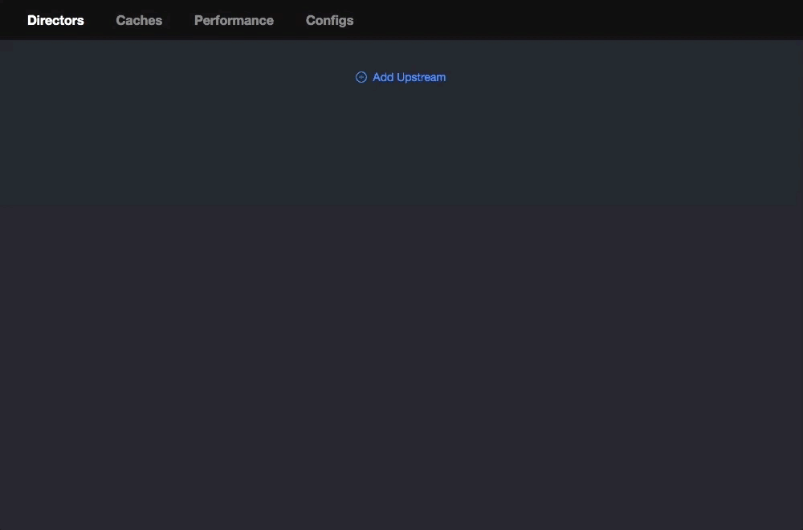

# pike

[](https://travis-ci.org/vicanso/pike)


HTTP cache server like `varnish`.


## 模块

- cache 缓存模块
  - brotli 提供brotli压缩
  - gzip 提供gzip压缩
  - cache 根据key获取相应的缓存数据，以分区的形式保存，减少锁的场景提升性能
  - lru LRU缓存
- config 应用程序配置模块
  - config 程序配置
  - etcd_config 从ETCD中读写配置
  - file_config 从文件中读写配置
- middleware 相关中间件
  - initialization 初始请求，主要判断是否超出最大请求数，设置请求头以及成功处理后设置响应头
  - cache_identifier 判断请求是否可缓存，如果不可缓存，直接转至下一中间件。如果获取不至缓存，则设置为fetch状态，根据最终响应数据转换为hit for pass或cacheable。如果获取到缓存，则设置缓存并转至下一中间件。
  - proxy 如果该请求已获取到相应的缓存数据，则转至下一中间件，否则转发至相应的upstream
  - responder 将缓存转换为相应的HTTP响应数据

## 测试场景

- [x] 非GET、HEAD直接请求pass至后端
- [x] 非文本类数据不压缩
- [x] POST不可缓存请求，后端返回数据未压缩
- [x] POST不可缓存请求，后端返回数据已压缩
- [x] GET不可缓存请求，后端返回数据未压缩
- [x] GET不可缓存请求，后端返回数据已压缩
- [x] GET可缓存请求，后端返回数据未压缩
- [x] GET可缓存请求，后端返回数据已压缩
- [x] 后端返回数据未添加ETag
- [x] 后端返回数据已添加ETag
- [x] 304的处理

## 性能测试


### 可缓存的接口，gzip(2436字节)，原数据9286字节

```bash
wrk -c1000 -t10 -d1m -H 'Accept-Encoding: gzip, deflate' --latency 'http://127.0.0.1:3005/chapters'
Running 1m test @ http://127.0.0.1:3005/chapters
  10 threads and 1000 connections

  Thread Stats   Avg      Stdev     Max   +/- Stdev
    Latency    23.90ms   47.63ms   1.23s    97.84%
    Req/Sec     5.16k   595.36     9.68k    76.77%
  Latency Distribution
     50%   16.88ms
     75%   23.88ms
     90%   38.70ms
     99%   94.31ms
  3081367 requests in 1.00m, 7.73GB read
Requests/sec:  51276.94
Transfer/sec:    131.68MB
```

### 可缓存的接口，br(1958字节)，原数据9286字节

```bash
wrk -c1000 -t10 -d1m -H 'Accept-Encoding: br' --latency 'http://127.0.0.1:3005/chapters'
Running 1m test @ http://127.0.0.1:3005/chapters
  10 threads and 1000 connections
  Thread Stats   Avg      Stdev     Max   +/- Stdev
    Latency    21.63ms   27.32ms   1.04s    94.50%
    Req/Sec     5.18k   534.52    11.17k    72.66%
  Latency Distribution
     50%   16.77ms
     75%   23.72ms
     90%   37.78ms
     99%   80.60ms
  3094104 requests in 1.00m, 6.38GB read
Requests/sec:  51480.91
Transfer/sec:    108.63MB
```

## 文件配置

首次启动时，无配置文件，因此需要通过ENV的形式指定管理后台路径，如下：

```bash
docker run -it --rm \
  -p 3015:3015 \
  -v ~/tmp/pike:/home/pike \
  -e ADMIN_PATH=/pike \
  vicanso/pike
```

打开地址`http://127.0.0.1:3015/pike/#/`，配置相关信息：



配置完成后，则可正式启动服务：

```bash
docker run -d --restart=always \
  -p 3015:3015 \
  -v ~/tmp/pike:/home/pike \
  vicanso/pike
```

## ETCD

建议使用ETCD来存储配置文件（便于启用多实例），如果未有ETCD的服务，可以使用下面的方式简单启动：

```bash
docker run -d --restart=always \
  -p 2379:2379 \
  --name etcd \
  vicanso/etcd etcd \
  --listen-client-urls 'http://0.0.0.0:2379' \
  --advertise-client-urls 'http://0.0.0.0:2379'
```

使用ETCD存储文件，需要指定连接地址，因为首次启动时，ETCD中无相关配置，因此需要通过ENV的形式指定管理后台路径，如下：

```bash
docker run -it --rm \
  -p 3015:3015 \
  -e CONFIG=etcd://172.20.10.2:2379/test-pike \
  -e ADMIN_PATH=/pike \
  vicanso/pike
```

后续的配置与使用文件的配置形式一样，在配置完成后，则可以正式启用服务：

```bash
docker run -d --restart=always \
  -p 3015:3015 \
  -e CONFIG=etcd://172.20.10.2:2379/test-pike \
  vicanso/pike
```

程序运行中会监听ETCD中配置的文件，自动更新配置，因此可以配置多实例，在其中一个的管理后台上修改配置则各实例实时生效。

