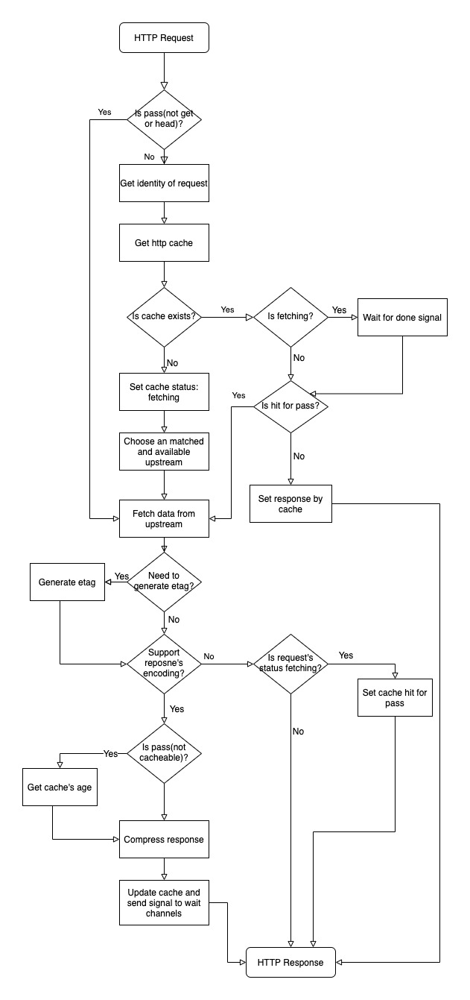

# Pike

高效简单的HTTP缓存服务，与varnish类似。

- 标准化的缓存TTL，基于HTTP响应头中的`Cache-Control`
- 简单易用的Web UI
- 支持br与gzip压缩，根据客户端动态选择压缩方式，预压缩缓存数据大幅度提升系统性能
- 支持无中断更新配置，更新配置后自动以新的配置启用新的HTTP服务并无中断式切换
- 支持h2c的upstream转发
- 可针对upstream或未处理异常配置自定义告警
- 支持配置加密证书后自动支持http2
- 可将HTTP所有请求统计写入influxdb，生成性能统计与监控告警


## 流程图

<p align="center">

</p>

## 相关脚本

### 开发

本项目使用go与nodejs开发，安装完成后执行以下命令则可运行项目。

```bash
# 使用etcd存储配置
go run main.go --config etcd://127.0.0.1:2379/pike --init

# 使用文件存储配置
go run main.go --config /tmp --init
```

```bash
cd web && yarn start
```

然后通过浏览器打开`http://127.0.0.1:3015/`则可。

### 编译

编译时需要使用packr2来打包静态文件，因此需要先安装packr2：

```bash
go get -u github.com/gobuffalo/packr/v2/packr2 
```

```bash
make build-web && make build 
```