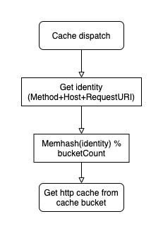
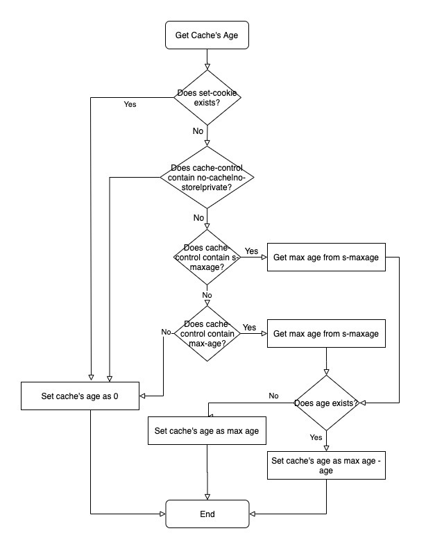

The http cache uses memory cache bucket(lru). Multiple buckets can be used for better performance. 256 buckets with bucket size of 1024 are suggested, which can meet most applications.

## How to get cache

- get identity by url(Method + Host + RequestURI)
- get hash by MemHash(identity), then get the bucket by mod
- get the cache from bucket

Get http cache from buckets is very simple, and the lru guarantees the timeliness of cache and help prevent using too many memories.

## How to get max age

The max age of http cache get from `Cache-Control`, the flow is:

## Suggestion

The design of pike guarantees only one request will be sent to upstream when same requests(identity) are processing, provided that cahe does not exist. Pike is usually used for high concurrency scenarioes. It is not recommended to cache slow request to improve the average time response. Short max age is more suitable than long one, which can help avoid purging cache manually. It's suggested that max age is limited to 5 minitues.
