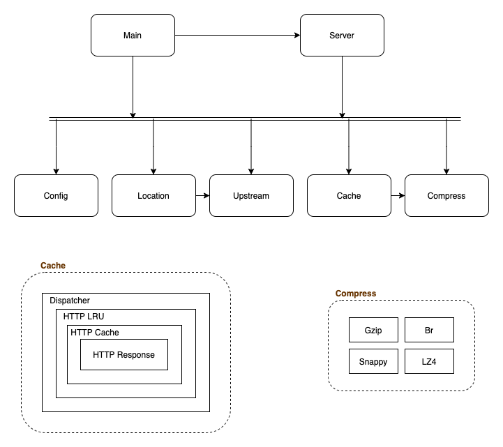
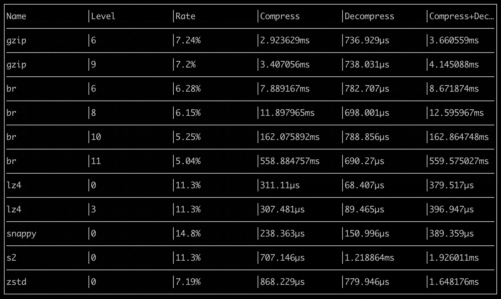

Pike有6个主要模块，下面对这些模块一一介绍。

## Compress

压缩模块主要提供数据解压与压缩服务，数据解压可针这几类压缩算法：gzip, br, lz4, zstd, snappy，用于在接收到upstream返回的数据时，根据其数据压缩类型，解压出原始数据。压缩则只提供gzip与br压缩，因为压缩的数据是响应返回至客户端（如浏览器），而现在的客户端支持的压缩算法主要为以上两种。

什么场景下upstream需要返回压缩的数据呢，，主要考虑的是以下场景：

- pike与upstream是在同一内网，网络传输不存在瓶颈问题，则upstream返回数据时不需要压缩
- pike与upstream部署在不同的IDC，网络通过专线传输，此时则可以考虑使用zstd或者snappy压缩响应数据，减少专线带宽的使用
- pike与upstream的访问通过公网访问，由于公网的网络性能较差，此时尽可量考虑使用br或者zstd压缩响应数据，提升性能

下面表示展示了压缩算法执行100次压缩解压的测试结果（原始数据45KB的json数据）：

由上图可以看出，br压缩使用的时间较长，一般建议使用6则可，而内网或专线等网络较好而又希望减少带宽占用的，可以在pike与upstream使用snappy，减少带宽占用，节约成本。
具体测试代码[compression-performance](https://github.com/vicanso/compression-performance)。

## Cache

缓存模块主要针对GET、HEAD的相关请求，保存缓存的数据或hit for pass状态，主要由以下小模块组成：

- `Dispatcher` 该模块使用memhash对请求生成hash，从初始化的LRU列表中获取对应的LRU
- `LRU` LRU缓存，缓存http cache对象
- `HTTPCache` http cache对象，控制当相同的请求访问时，如果状态未知，只允许一个请求转发至upstream，其它的访问等待。而在获取到状态后，如果是可缓存则直接返回，若是hit for pass则转发至upstream.
- `HTTPResponse` http response对象，根据请求的客户端接受的编码以及响应数据长度，选择最合适的压缩方式并返回

缓存的详细流程请阅读[缓存模块](./cache-handler.md)，缓存模块使用压缩模式实现数据压缩。

## Upstream

Upstream模块，该模块实现对配置的upstream服务检测是否可用，按指定的策略返回对应的server地址，实现的功能如下：

- 定时检测配置的各服务地址是否正常（配置health check的则使用http访问，如果未配置，则以tcp的方式检测端口）
- 根据配置的策略选择可用的服务地址

## Location

Location模块，该模块根据配置的host与prefix规则，判断请求是否属于该location，如果属于则将请求转发至其下的upstream，实现的功能如下：

- 根据host与prefix判断请求是否属于该location
- 根据配置的rewrite，在转发前修改url，在完成后恢复
- 根据配置的query string以及request header，将当前配置添加至请求中
- 获取响应后将配置的response header添加至响应头中

## Config

Config模块，该模块主要实现配置的读写，支持使用文件与etcd的形式保存配置，并可检测配置变化实时更新配置。

## Server

Server模块，该模块监控端口，在接收新的请求时，通过各中间件完成缓存的读取或转发，实现的功能如下：

- `Error` 出错中间件将出错转换为对应的json响应或text响应
- `Fresh` 304中间件处理，根据请求头与响应头判断数据是否无修改
- `Responder` 响应中间件，使用`HTTPResponse`根据客户端响应适当的数据
- `Cache` 缓存中间件，获取当前请求对应的缓存，如果有响应则设置缓存，否则则转至下一中间件
- `Proxy` proxy中间件，根据当前请求获取对应的location，转发至相应的upstream服务器地址，获取成功后则设置响应数据
