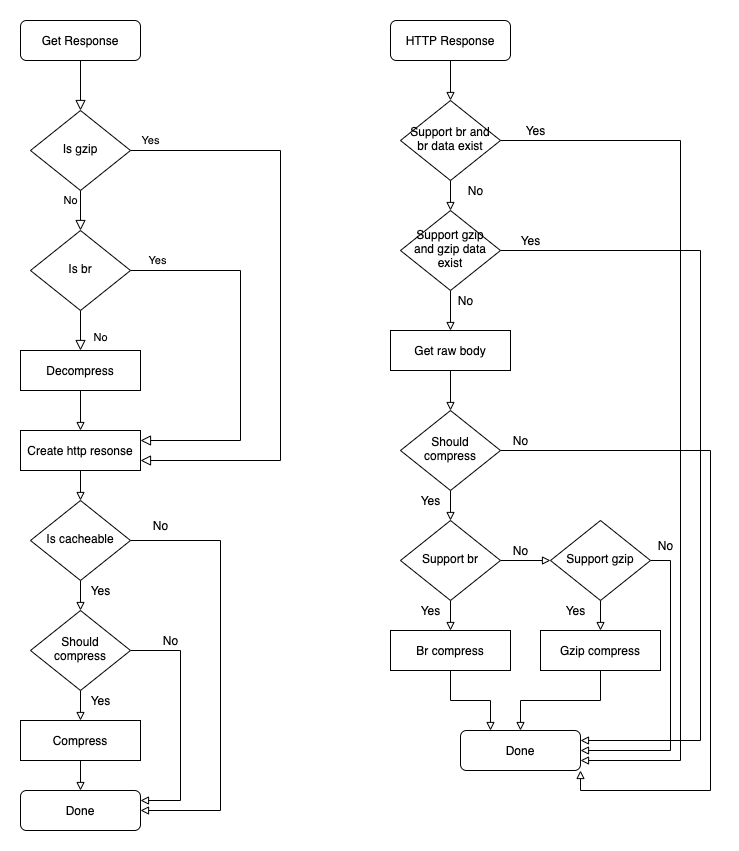

请求响应的处理主要分两步，一是从upstream中获取响应（或从缓存中），二是根据响应与客户端选择符合的响应数据。HTTP响应数据主要有以下字段：

- `GzipBody` gzip压缩的body
- `BrBody` br压缩的body
- `RawBody` 原始未压缩的body
- `Header` HTTP响应头 

## 从Upstream中获取响应

参考上面的流程图，从upstream中获取响应之后，主要根据响应头的Encoding以及是否可缓存生成不同的响应数据。

- 如果upstream的响应数据是gzip或br压缩，直接生成对应的GzipBody或BrBody
- 如果upstream的响应数据是未压缩的，直接生成对应的RawBody
- 生成HTTP Response之后，判断该请求是否缓存并且可压缩（根据Content-Type判断），如果可缓存压缩则生成GzipBody以及BrBody，并清除RawBody

需要注意，对于不可缓存的数据，生成HTTP Response时，upstream返回的数据并不处理，直接保存。而对于可缓存的数据，则根据其是否可压缩生成gzip与br的数据，并清除RawBody，因此RawBody并不会与压缩的数据同时存在。

## 从HTTP Response中响应数据

参考上面的流程图，从HTTP Response中响应客户端的主要流程如下：

- 客户端支持br压缩，而且已有br压缩数据，则直接返回响应
- 客户端支持gzip压缩，而且已有gzip压缩数据，则直接返回响应
- 响应数据不应该被压缩，则直接返回原始数据
- 客户支持br压缩，则对数据压缩后返回
- 客户端支持gzip压缩，则对数据压缩后返回
- 客户端不支持压缩，则返回原始数据

需要注意，对于可缓存压缩数据，在生成缓存时会预压缩（同时生成br与gzip压缩），因此可以减少压缩数据对性能的损耗（一次压缩多次使用）