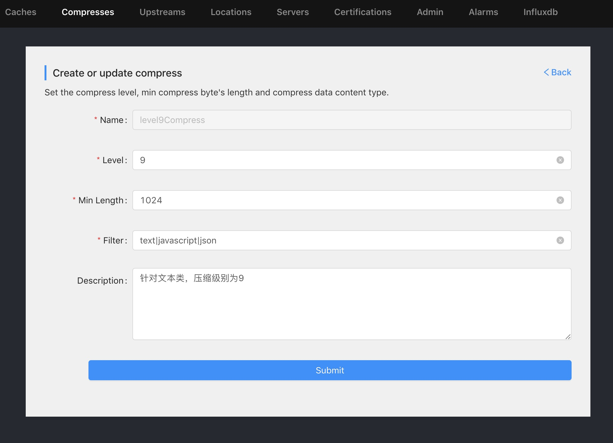
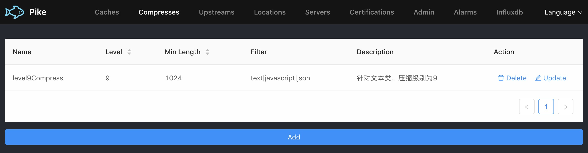
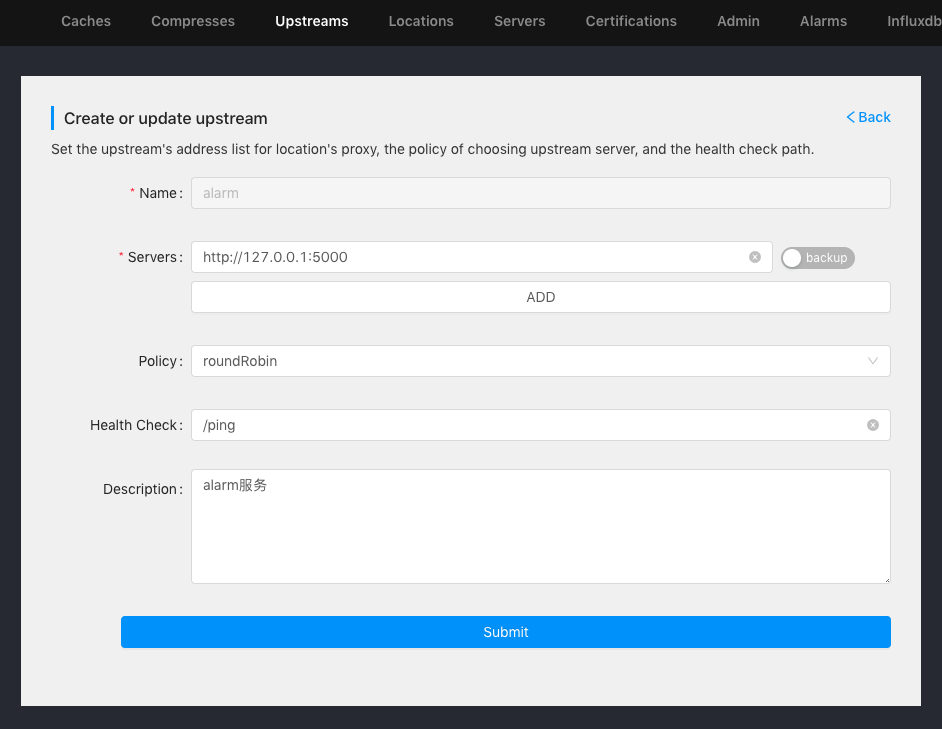
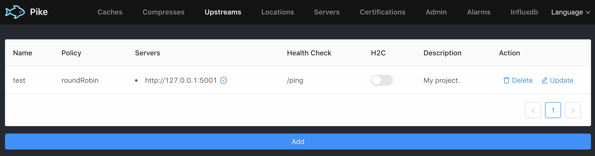
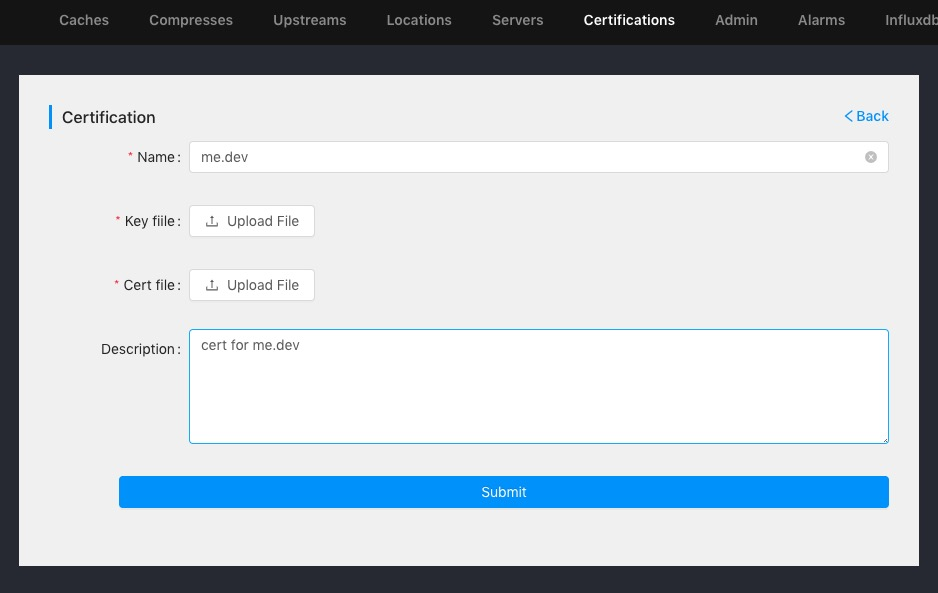
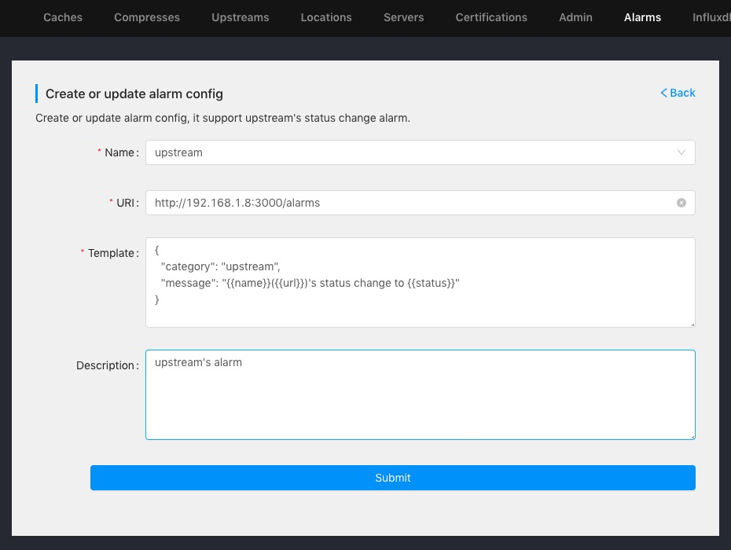
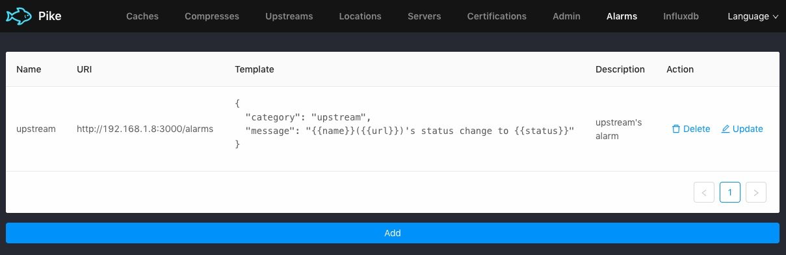
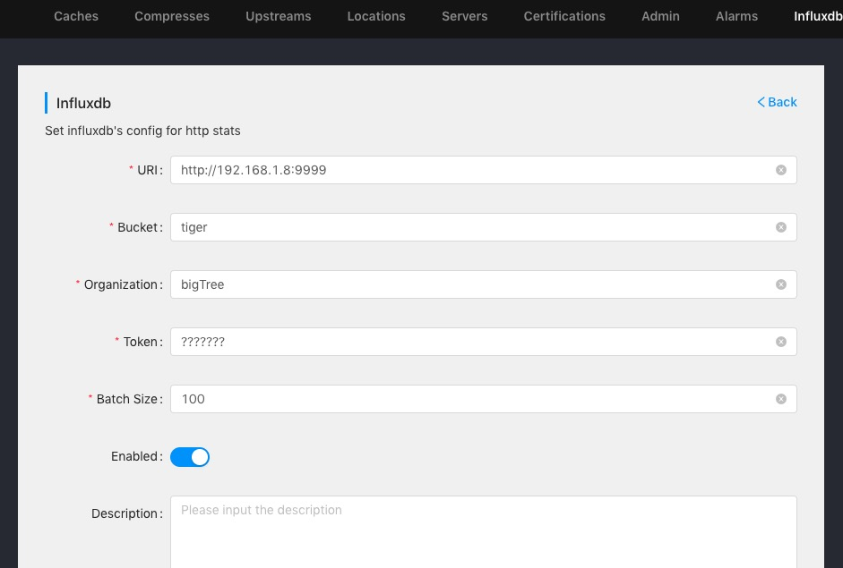
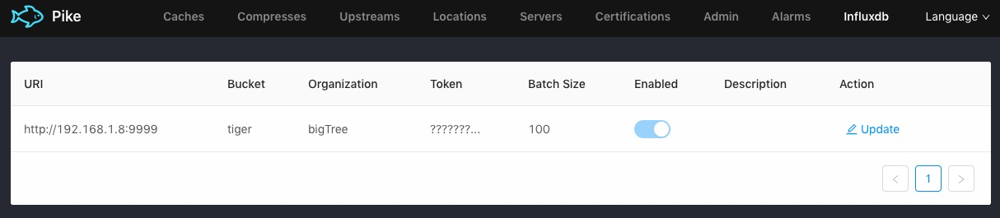

Pike是纯go的项目，因此可以编译各平台的执行文件（暂未提供各平台的执行文件）或者直接使用打包好的docker镜像(vicanso/pike)，配置支持保存在文件或etcd中。建议使用etcd来保存，方便多实例部署。

## 启动

```bash
# 文件形式
docker run -it --rm -p 3015:3015 vicanso/pike --init --config /tmp

# 以etcd的形式
docker run -it --rm -p 3015:3015 vicanso/pike --init --config etcd://192.168.1.8:2379/pike
```

`--init`在首次启动时需要指定，由于此时暂无相应配置，因为会默认启用一个3015端口的服务，用于首次配置时使用。在浏览器中打开`http://部署服务IP:3015/pike/`则可访问管理后台。

## 缓存配置

缓存用于HTTP的数据缓存以及不可缓存接口的hit for pass，参数配置如下：

- `Name` 缓存名称，用于`Server`配置中勾选其使用的缓存
- `Size` 缓存桶的数量，获取HTTP缓存会生成hash取余获取对应的缓存桶，按需设置则可
- `ZoneSize` 缓存桶的大小，每个缓存桶都是lru缓存，当缓存过多时会自动清除最久未使用数据，根据项目的需求设置则可。Size * ZoneSize为缓存的总容量。
- `HitForPass` 设置不可缓存请求的缓存时长，一般设置5或10分钟则可。
- `PurgedAt` 定时清除过期缓存，建议设置为服务不活跃的时间，如深夜2点等。因为使用的是lru缓存，缓存不会超过最大容量，因此如果内存不是特别紧缺，可以只设置一天清除一次
- `Description` 描述

`HitForPass`不要设置过长或者过短的时间，因为Pike是对于当多个相同请求时，如果其状态未知是否可缓存请求(GET/HEAD)，仅会发送一个请求，根据返回的`Cache-Control`来判断是否可缓存。如果可缓存则直接响应数据并处理等待中的请求。对于不可缓存，返回数据，设置它为hit for pass，并让等待中的请求转发至upstream。之后相同的请求就会命中hit for pass，直接转发至upstream。因此设置不要太短的请求可以保证不可缓存的请求避免过多的等待状态。那么如果设置过长是否会有问题呢？如果upstream的服务保证接口的缓存性（可缓存或不可缓存）无论怎样都不会变化，那可以设置更长的有效期，避免经常性的因为缓存状态未知而等待。

<p align="center">


</p>

## 压缩配置

指定HTTP数据压缩的参数，参数配置如下：

- `Name` 压缩配置名称，用于`Server`配置中勾选其使用的压缩配置
- `Level` 压缩级别，gzip与br使用相同的压缩级别，对于互联网应用，建议使用9。若是局域网应用，可选择较低的压缩级别以提升压缩效率
- `MinLength` 压缩的最小字节长度，一般选择1KB则可，因为过小的数据压缩有可能反而数据量变大。对于有特殊应用场景可根据场景选择更大的配置
- `Filter` 指定哪些数据类型压缩，默认为`text|javascript|json`，包括了常用的字符类数据，它根据正则匹配HTTP响应的Content-Type判断是否需要压缩
- `Description` 描述

数据压缩能节约带宽，提升应用体现（因为网络传输的时长比压缩损耗的时长大的多），对于互联网类应用，尽可能配置数据压缩。数据是否压缩根据`Content-Type`是否匹配filter，数据长度是否大于MinLength，符合这两个条件的才会被压缩。

<p align="center">


</p>

## Upstream配置

各上游服务应用的配置，尽可能配置多实例，参数配置如下：

- `Name` 应用服务名称，用于`Location`配置中勾选其对应的上游服务
- `Servers` 应用服务地址，由协议、IP与端口组成，如`http://192.168.1.8:3000`，如果打开`backup`标记，则表示该应用地址为备选服务，只有非backup的服务都不可用时才使用备选
- `Policy` 应用服务的选择方式，提供常用的几种策略，一般使用roundRobin则可
- `HealthCheck` 应用服务健康检测，如果不配置则健康检测是通过判断端口是否有监听的形式，建议配置此参数为特定的检测url，该url的处理最好仅是用于判断服务是否可用，不建议使用逻辑特别复杂的url
- `Description` 描述

Policy的服务选择策略并没有提供会话保持的形式，对于需要会话保持的使用数据库来实现。

<p align="center">


</p>

## Location配置

配置Location的匹配参数，如Host、URL前缀等，参数配置如下：

- `Name` Location名称，用于`Server`配置中勾选其所包括的location
- `Upstream` Location的upstream配置，符合该location的请求则转发至对应的upstream
- `Hosts` 配置对应的Host列表，如果pike用于多个不同的host的服务，则按需配置其所对应的host，可支持配置多个host
- `Prefixs` 配置对应的URL前缀，如果不同的Location使用相同的host，则可以按url前缀来区分不同的服务，可支持配置多个前缀
- `URLRewrites` URL重写配置，支持针对符合的URL重写，如/api/* -> /$1 则表示转发时将/api前缀删除
- `RequestHeader` 公共请求头，该location的所有请求转发时都会添加相应的请求头
- `ResponseHeader` 公共响应头，该location的所有响应都会添加相应的响应头
- `Description` 描述

<p align="center">


</p>

## Server配置

配置Server的启动参数，如监听端口等，参数配置如下：

- `Name` Server的名称
- `Adress` 监听的地址，如`:3000`或者`127.0.0.1:3000`
- `Cache` 缓存配置
- `Compress` 压缩配置
- `Locations` 对应的Location列表，可勾选多个
- `Certs` 使用的https证书
- `ETag` 是否启动生成ETag
- `Concurrency` 并发限制，根据应用场景限制最高并发数
- `ReadTimeout` http.Server的ReadTimeout配置
- `ReadHeaderTimeout` http.Server的ReadHeaderTimeout配置
- `WriteTimeout` http.Server的WriteTimeout配置
- `IdleTimeout` http.Server的IdleTimeout配置
- `MaxHeaderBytes` http.Server的MaxHeaderBytes配置
- `Description` 描述

Pike的大部分配置修改都可立即生效，但是Server中的几个配置修改是需要重启程序的，包括：`Adress`, `ReadTimeout`, `ReadHeaderTimeout`, `WriteTimeout`, `IdleTimeout`, `MaxHeaderBytes`，因此这些参数是在创建http.Server是初始化使用，在造成完成后则不会再更新。

<p align="center">


</p>

## 证书配置

上传配置证书，参数如下：

- `Name` 证书名称
- `KeyFile` 证书key文件
- `CertFile` 证书文件
- `Description` 描述

<p align="center">

</p>

## 管理配置

后台管理配置，若不配置账户密码则只要知道路径则可访问，建议设置账户密码，参数如下：

- `User` 登录用户
- `Password` 登录密码
- `URLPrefix` 管理后台的前缀，默认为/pike，可以根据需要调整其路径
- `InternetAccess` 是否允许互联网访问，需要注意，如果禁止互联网访问则只能内网IP才允许访问管理后台
- `Description` 描述

<p align="center">


</p>

## 告警配置

应用告警配置，如upstream状态变化(失败或成功)，参数如下：

- `Name` 告警名称，只能选择支持的告警，暂仅支持upstream的告警
- `URI` 请求地址，当告警触发时，将相应的告警数据发送至此地址
- `Template` 数据模板，当告警触发时，填充相应字段后则将数据发送
- `Description` 描述

<p align="center">


</p>

## influxdb配置

influxdb的配置，用于将http请求的统计信息写入influxdb，参数如下：

- `URI` influxdb的地址
- `Bucket` influxdb中创建的数据桶
- `Organization` influxdb中的组织信息
- `Token` influxdb中获取到的token
- `BatchSize` 批量提交的大小，建议最少设置100以上，对于访问量特别大的网站，可以设置为1000或者5000
- `Enabled` 是否启用统计写入influxdb
- `Description` 描述

<p align="center">


</p>